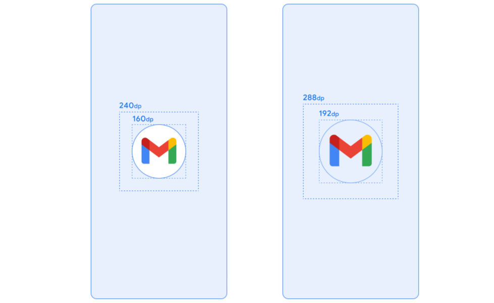

# Android Splash Screen

This project contains the steps to create a splash screen for your Android application. Follow the steps below to create your splash screen.

## Requirements 

- Android Studio
- AndroidX Core Library

## Steps

### 1. Adding the Library

Add the required library for your splash screen to your `build.gradle` file:

``groovy
implementation("androidx.core:core-splashscreen:1.0.1")``

### 2. Resizing Images

Resize your images to the appropriate dimensions for the splash screen. It's important to prepare images in various sizes to ensure they look good on different screen sizes of your application.

  

  ### 3. Creating a Splash Screen Theme

Create a splash screen theme in the `res/values` directory. Additionally, add a theme for dark mode to ensure compatibility with different user preferences.

### 4. Updating AndroidManifest.xml

Navigate to the `AndroidManifest.xml` file and update your application to use the splash screen theme you created.

### 5. Implementing the Splash Screen

In the `MainActivity` class, call the `installSplashScreen()` method before the `setContentView()` method.

  
